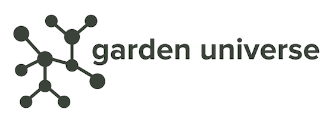

# garden-universe

---

# Overview
Garden universe renders a Kubernetes landscape which is setup and managed by the [Gardener Project](https://github.com/gardener/gardener) into a dynamic 3D graph. An example landscape visualization can be found [here](images/universe.png).

# Development

To build and run the garden universe
```
git clone https://github.com/afritzler/garden-universe $GOPATH/src/github.com/afritzler/garden-universe
cd $GOPATH/src/github.com/afritzler/garden-universe
go run *.go serve --kubeconfig=PATH_TO_MY_GARDEN_CLUSTER_KUBECONFIG
```

or to run it using the executable
```
make
./garden-universe serve --kubeconfig=PATH_TO_MY_GARDEN_CLUSTER_KUBECONFIG
```

The web UI can be accessed via http://localhost:3000 and the rendered graph under http://localhost:3000/graph.
With `--port` you can also specify under which port the garden universe server should be exposed (default is 3000).

To build the Docker image
```
cd $GOPATH/src/github.com/afritzler/garden-universe
make docker-build
```

# Acknowledgements
Garden universe is using the [3d-force-graph](https://github.com/vasturiano/3d-force-graph) for rendering. 
