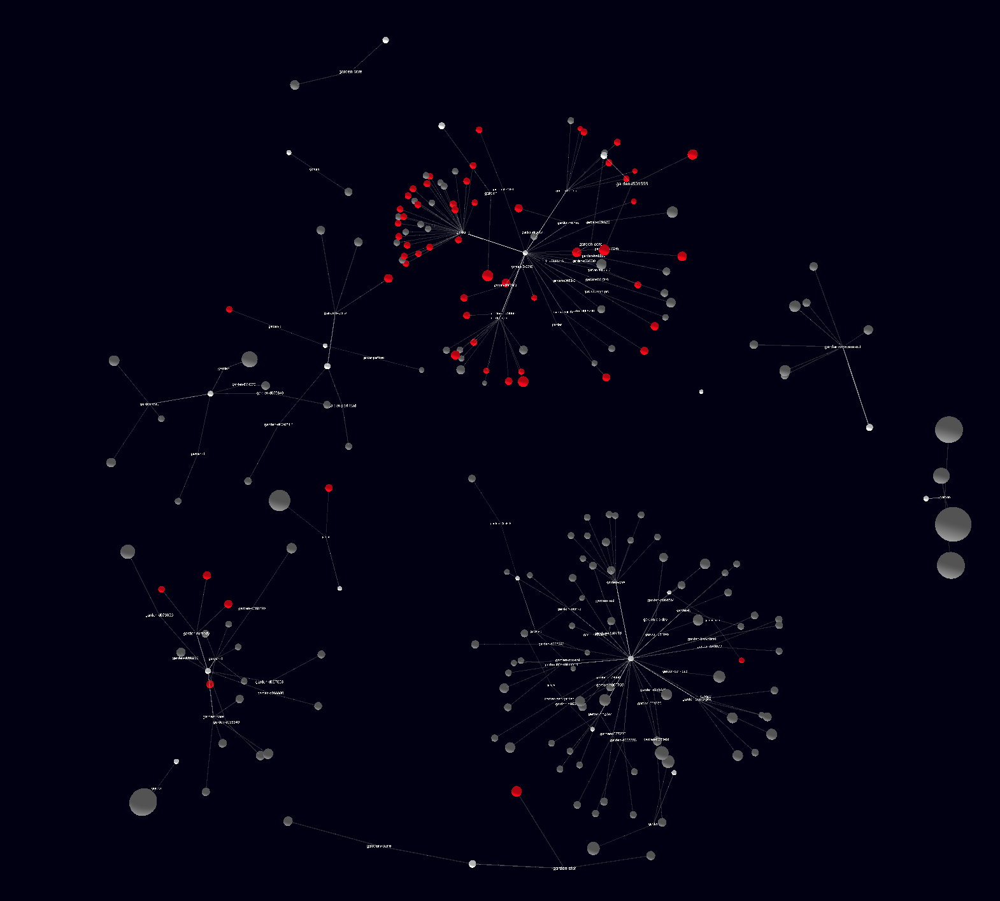

---

# Overview
Garden universe renders a Kubernetes landscape which is setup and managed by the [Gardener Project](https://github.com/gardener/gardener) into a dynamic 3D graph.



# Development

To locally run the garden universe
```
git clone https://github.com/afritzler/garden-universe
go run *.go serve --kubeconfig=PATH_TO_MY_GARDEN_CLUSTER_KUBECONFIG
```
The web UI can be accessed via http://localhost:3000